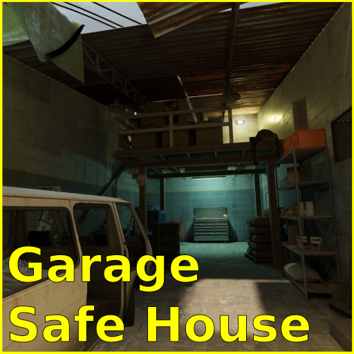

# Garage Safe House

[][workshop]
[][workshop]
[][workshop]

This repository contains the Garage Safe House Half-life: Alyx map source files.
This map is built using the official Workshop tools.

## Installing
The easiest way to play the map is to [subscribe to Garage Safe House on the Steam Workshop][workshop].

However, if you wish to build the map yourself, or incorporate it into your own project, then do the following:

1. Install the [Half-Life: Alyx Workshop Tools](https://developer.valvesoftware.com/wiki/Half-Life:_Alyx_Workshop_Tools).
2. Create a new addon.
3. Place all the files in the `maps` directory into `content\hlvr_addons\your_addon_name\maps`.
4. Open `garage_safe_house.vmap` in Hammer and press **F9** to start a build.

## Concept
The [Level Design Document](docs/level-design-document.pdf) explores the concept and design of the level.

## License
These files are licensed under [CC-BY-4.0](LICENSE.txt).

[workshop]: https://steamcommunity.com/sharedfiles/filedetails/?id=2482588479

